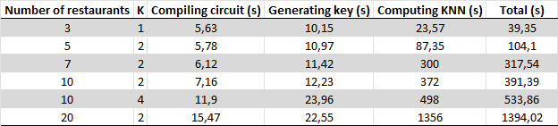

# K Nearest Neighbors
## Introduction

The use of maps to find nearest point of interest (e.g. closest restaurants) is common. However, using such features may reveals sensitive personal information. In this tutorial, we demostrate how to use Zama's homomorphic encryption to find the K nearest restaurant to a given input while preserving the localisation's privacy.

In this scenario, the server does not learn anything about a client's position at anytime as it sees only encrypted data.

## Achieving Privacy
In our application demo:

  1. The client owns its position. This information is never shared in clear with the server.
  1. The server owns map data. It only shares with the client the coordinates of the K closest restaurants to its position.

To achieve this, FHE is used to implement swap sort. The server receives the encrypted coordinates and calculates the distance for each restaurant on the list. The server then perfoms a partial sort using swaps (an equivalent to [bubble sort](https://en.wikipedia.org/wiki/Bubble_sort)). It retrieves the encrypted coordinates of the K nearest restaurants and sends them to the client. The client decrypts the results.

## Demo App
A demo streamlit app is available on [Quadratic's HuggingFace](https://huggingface.co/spaces/Quadratic-Labs/PrivateNearestNeighbors-FHE):

It can also be deployed locally in the usual way:

  1. Create a python virtual environnement and activate it.
  1. Install dependencies from requirements.txt:  pip install -r requirements.txt
  1. Launch the app: streamlit run app.py
  
The app depends also on files found in data/ folder:

  1. circuit.zip : use generate_circuit.py to recompile the circuit if necessary (on new network data).
  1. key.zip : cached keys. If not present, they will be generated.
  1. restaurants.geojson: map data extracted from OSM (overpass-turbo API). See NearestExample.ipynb for more information.

## Data Extraction

The data used as example in this notebook are extracted from [overpass-turbo](https://overpass-turbo.eu) using the following query :

```
    // gather results
    nwr["amenity"="restaurant"](48.874256063816,2.3389828205109,48.876909238658,2.3433548212051);

    // print results
    out;
```

This query returns a list of restaurants in a given area


## Explanation of the swap sort


The swap sort is implemented using three TLUs :
```
  relu = fhe.univariate(lambda x: x if x > 0 else 0)
  is_positive = fhe.univariate(lambda x: 1 if x > 0 else 0)
  odd_halving = fhe.univariate(lambda x: (x - 1) // 2 if x % 2 else 0) 
```

The first returns x if x is strictly positive and zero otherwise. 
The second returns one if x is positive and zero otherwise.
The last returns half the value minus one for odd numbers, and zero otherwise.


The combination of the three functions is used to perform the swap. Here a snippet of the swap function:

```
def swap(this_idx, this_dist, that_idx, that_dist):
    """
    Swaps this and that if this > that.
    We must pass both the index and the distance for both this and that.

    Returns:
      idxmin, min, idxmax, max of this and that based on distance
    """
    diff = this_dist - that_dist
    idx = odd_halving((this_idx - that_idx) + (this_idx - that_idx) + is_positive(diff))
    dist = relu(diff)

    idx_min = this_idx - idx
    idx_max = that_idx + idx
    dist_min = this_dist - dist
    dist_max = that_dist + dist
    return fhe.array([idx_min, dist_min, idx_max, dist_max])
```

To decide weither or not to swap two values with their respective indices, we start by calculating the difference.

```
diff = this_dist - that_dist
```

Then, on the basis of this difference, we calculate 'idx', the index change to be made on the original indices. 


```
idx = odd_halving((this_idx - that_idx) + (this_idx - that_idx) + is_positive(diff))
```

If the difference is positive (i.e. this > that), the input to odd_halving is always odd ((this_idx - that_idx) + (this_idx - that_idx) is even). 
The result of odd_halving is then (this_idx - that_idx), which is the difference to be applied to the original indices. Otherwise, the result is zero and the indices remain unchanged.


The values are swaped (or not) depending on the diff value. We use a relu to achieve this. If the difference is positive, the values should be swaped, otherwise the relu returns zero and the values remain unchanged. 


The code extract below illustrates how the swap function works.


```
if this > that :
    diff = this_dist - that_dist > 0
    idx = odd_halving(2 * (this_idx - that_idx) + is_positive(diff)) = odd_halving(2 * (this_idx - that_idx) + 1) = this_idx - that_idx
    dist = relu(diff) = diff

    idx_min = this_idx - idx = this_idx - (this_idx - that_idx) = that_idx
    idx_max = that_idx + idx = that_idx + (this_idx - that_idx) = this_idx
    dist_min = this_dist - dist = this_dist - diff = this_dist - (this_dist - that_dist) = that_dist
    dist_max = that_dist + dist = that_dist + diff = that_dist + (this_dist - that_dist) = this_dist

else :
    diff = this_dist - that_dist < 0
    idx = odd_halving(2 * (this_idx - that_idx) + is_positive(diff)) = odd_halving(2 * (this_idx - that_idx) + 0) = 0
    dist = relu(diff) = 0

    idx_min = this_idx - idx = this_idx
    idx_max = that_idx + idx = that_idx
    dist_min = this_dist - dist = this_dist
    dist_max = that_dist + dist = that_dist
```

## Size of the map
The list of restaurants is presently confined to a predetermined area. We select seven restaurants and adjust the number of neighbors, K, to two (both parameters can be updated in config.py). With the current configuration on the Hugging Face server, the expected running times are up to 15 seconds for key generation and up to 4 minutes for the run. Increasing the number of displayed restaurants or the number of neighbors will significantly increase the execution time. Please refer to the figure below for different settings.



One potential optimization is using  [heap sort](https://en.wikipedia.org/wiki/Heapsort) instead of swap sort. This change will decrease the number of comparisons and, presumably, reduce the execution time.